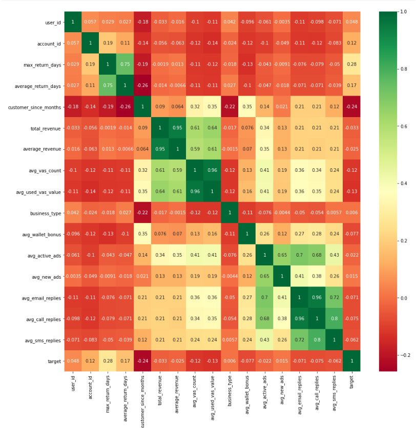
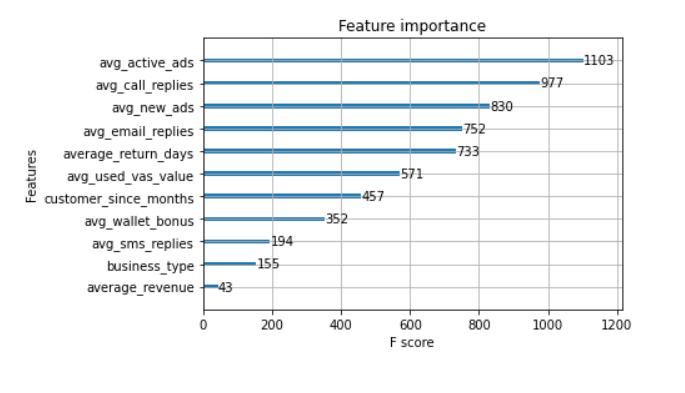
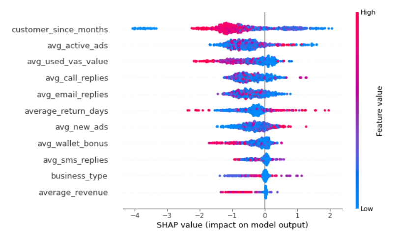

# Customer-Behavior-Analysis
 
## Metadata for the columns.

**max_return_days**: Maximum number of days in which user made a re-purchase

**average_return_days**: Average number of days in which user made a purchase

**customer_since_months** : No of months since user started paying

**total_revenue**: Total revenue made from this user

**average_revenue**: Average revenue made from this user

**avg_vas_count**: Average amount of vas counts

**avg_used_vas_value**: Average number of vas used by the user

**business_type**: Business type

**avg_wallet_bonus**: Average bonus amount in wallet

**avg_active_ads**: Average no of active ads

**avg_new_ads**: Average no of new ads

**avg_email_replies**: Average no of email replies

**avg_call_replies**: Average no of call replies

**avg_sms_replies**: Average no of sms replies

**target**: If user stays or leaves

So we have to train a model to find out whether a user stays or leaves based on the given data

# Feature Correlation

# Results

For Detailed Analysis Please refer to this jupter Notebook

[Notebook](Notebook.ipynb)

## Feature Importance

<!-- ## Feature Importance -->

